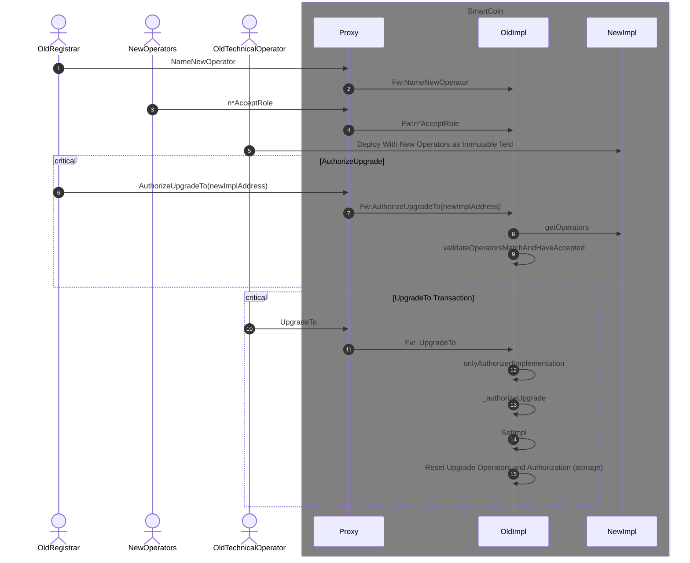

  

# Description
 
The SmartCoin contract is basically an ERC20 with a few specifics
 
The Registrar is responsible for managing elegible entities.
 
The Registrar is also responsible for freeze addresses, unfreeze addresses, mint, burn and wipe frozen addresses.

## Transfer to the Special Entities 

A modified version of ERC-20 transfers is used, transfers to the specials entities (i.e. registrar and operations) are restricted.
Only direct transfer can be made, they cannot be the destination of an approve or a transferFrom.
When the transfer function is called with thoses entities as destination a transfer request is emited.
Tokens will not be transfer until the registrar validate that transfer request.
Until the registrar validate or reject the request, tokens are "engaged".
While engaged, tokens cannot be moved from the holder balance.

## Contract and Operator Upgrades

The implementation upgrade and operator upgrade are tied.
For the operator to be well regulated, token transaction to/from them are restricted. 
This mean that for each transaction (transfer/approve/transferFrom) checks are to be performed.
The goal of this is to lower gas cost of those checks, by storing the operator in the bytecode, while keeping a secure way to update the Operators.

The main step to perform an upgrade are :

- Registrar name the next Operators
- Each operator accept the role
- The actual Technical deploy a new contract
- The actual Registrar authorize the update to the new contract
- The actual Technical launch the UpgradeTo fonction
- The upgrade to function check each operator is Ok, then upgrade is performed

### Sequence Diagram

# Pre-requisites

1. Node.js 16.15
2. npm

# Usage

Configure an environment file `.env` using the example seen in `env.sample`
Install the package dependencies via `npm install`
Compile the project via `npm run build`

Deployment is done via hardhat by supplying a network to the `deploy` command as follows: `npm run deploy -- --network sepolia`

Unit tests can be run via `npm run test`, and code linting can be performed via `npm run lint`

# Bug Reports

Issues found in the project can be reported by opening an issue on this repository.
Pull Requests should adhere to the provided template.
